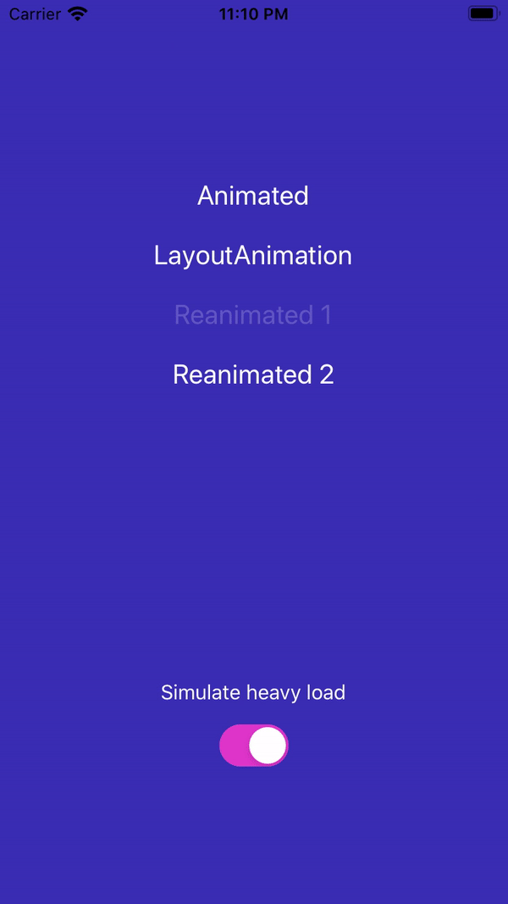

# Comparing React Native animation libraries

Comparing an expandable card animation with the following libs:

- Animated
- Layout Animation
- Reanimated 1
- Reanimated 2

<br>


## Installation

```bash
yarn
npx pod-install
react-native run-ios
```

## Usage

Toggle the "heavy load"-switch to make a basic performance comparison. When enabled, many additional invisible views are rendered within the card. This makes the performance difference between a native and a js driven animation obvious.

The default Animated library does not support native driven animations for properties such as height. The other libs does support native driven animations.

## Run the example

- Clone the repository
- Run `yarn` to install the dependencies of library
- `cd` to this directory
- Run `yarn` to install the dependencies of example
- Run `yarn start` to start the packager with custom config
- Run `pod install` in the `ios` folder for running on iOS
- `react-native run-ios` or `react-native run-android`
